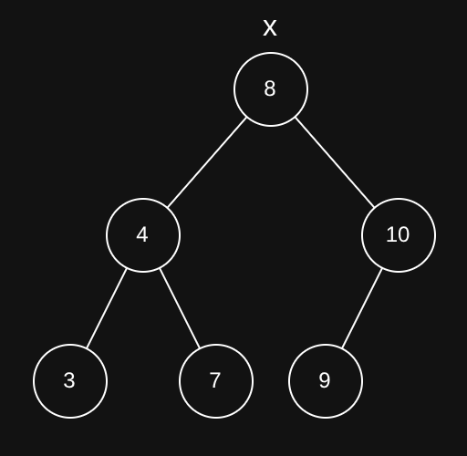
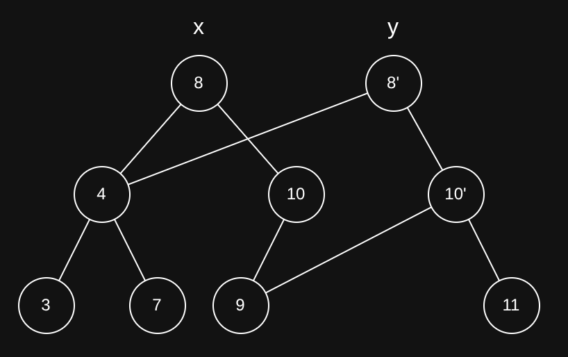

# The What

- Data structures that are immutable
  - Operations does not change the structure
  - Instead it copies the data to a new version
- Data can be shared between versions

---

# The Why

- Immutable structures are thread safe
- Aligns well with idiomatic F#
  - No side effects
- Downside: Uses more memory
  - Can be helped by reusing parts of the old structure

---

# BST

```f#
type BST<'a> =
  | Empty
  | Node of BST<'a> * 'a * BST<'a>
module BST =
  val insert<'a>   : 'a   -> BST<'a> -> BST<'a>
```



---

### BST



---

### Set

```f#
type Set<'a,'b>
```

- Elements are unique
- Immutable
- Can only hold elements which can be ordered
  - Internally has a tree structure

---

### Set creation

```f#
let s1 = set [1;2;3;4;5]
let s1' = Set.add 6 s1
let s1'' = Set.remove 3 s1
```

- Functions are kept pure and side effect free

---

### Other set functions

```f#
let first = set [1; 2]
let second = set [3; 4]
let third = set [1; 4]

Set.union first second
// val it : Set<string> = set [1; 2; 3; 4;]
Set.intersect first third
// val it : Set<string> = set [1]
Set.difference first third
// val it : Set<string> = set [2]

- All the functions from list also work: map, filter, fold and foldBack
```

---

### Map

```f#
type Map<'a,'b>
```

- Key/value pairs
- Keys are unique
- Immutable
- Keys also required to be sortable
  - Internally a tree structure

---

### Map functions

```f#
let m1 = Map.ofList [("k1", 1); ("k2", 2); ("k3", 3), ("k4", 4)]
let m2 = Map.add "k5" 5 m1
let m3 = Map.remove "k1" m1
```

---

### Sequence

- Lazy evaluated
- Possibly infinite
- Can be initiated with a `int -> 'a` function

```f#
let x = Seq.initInfinite (fun i -> i)
```

---

### Sequence

```f#
let e5 = Seq.item 5 x
```

Only evaluates the 5th element
Will evaluate at each call.

---

### Sequence caching

```f#
let cachedX = Seq.cache x
let e5 = Seq.item 5 cachedX
```

Evaluates and caches all elements from 0-5
